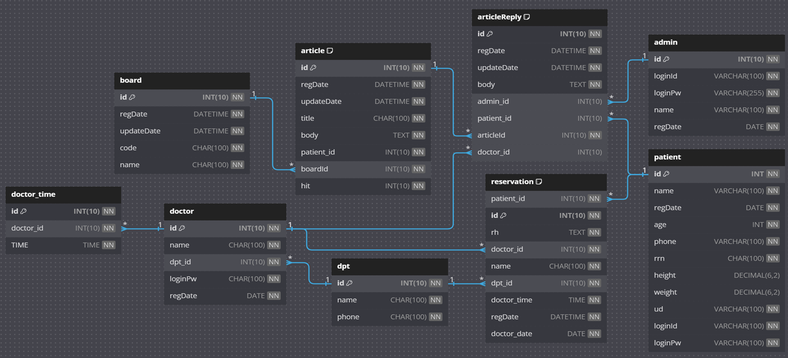

<p align="center">
   
</p>

# 병원 예약 프로그램
<br><br>

# 💬 프로젝트 설명
-  환자가 효율적으로 병원 예약을 관리하고 예약된 시간에 의료 서비스를 받을 수 있도록
지원하는 프로그램으로 환자들은 오랜 대기 시간을 피하고 병원은 예약 및 진료 관리를 효율적으로 할 수 있습니다.

# 💨 개발 기간
- 2024 4.08 ~ 2024 4.23

# 🛠 개발 환경
- 운영체제 : Windows 10, 11
- 통합개발환경(IDE) : IntelliJ
- JDK 버전 : JDK 21
- 빌드 툴 : Gradle
- 관리 툴 : GitHub

# 💻 기술 스택

### Version Control
<div>
    
</div>

### Backend Technologies
<div>
    
</div>

### Databases
<div>
    
    
</div>


# 👥 개발 팀원
|                                                               **김민섭**                                                                |
|:------------------------------------------------------------------------------------------------------------------------------------:|
| [ <br/> @kimminseop99](https://github.com/kimminseop99)|


### 🕴️ 김민섭
+ UI, 페이지
  - 메인 페이지
  - 회원 페이지
  - 예약 페이지
  - 게시판 페이지
  - 의료진 페이지
  - 관리자 페이지
+ 기능
  - 회원가입
  - 예약 
  - 예약 취소 
  - 진료 
  - 게시글 생성
  - 게시 글 수정, 삭제
  - 게시 글 댓글
  - 관리자 암호
  - 관리자 관리

# 🗃️ ER 다이어그램



# 🗂️ 프로젝트 구조

```
   └─src
    └─main
        └─java
            └─org
                └─example
                    │  App.java
                    │  Main.java
                    │
                    ├─container
                    │      Container.java
                    │
                    ├─controller
                    │      AdminController.java
                    │      ArticleController.java
                    │      Controller.java
                    │      DoctorController.java
                    │      MemberController.java
                    │      ReservationController.java
                    │      Session.java
                    │
                    ├─dao
                    │      AdminDao.java
                    │      ArticleDao.java
                    │      Dao.java
                    │      DoctorDao.java
                    │      MemberDao.java
                    │      ReservationDao.java
                    │
                    ├─db
                    │      db.sql
                    │      DBConnection.java
                    │      sbs_proj_db_data.sql
                    │
                    ├─dto
                    │      Admin.java
                    │      Article.java
                    │      ArticleReply.java
                    │      Board.java
                    │      Doctor.java
                    │      Dto.java
                    │      Member.java
                    │      Reservation.java
                    │
                    ├─images
                    │      adminPage.png
                    │      articlePage.png
                    │      doctorPage.png
                    │      ERD.png
                    │      median logo.png
                    │      memberPage.png
                    │      reservationPage.png
                    │
                    ├─resource
                    │      ChangeInfo.java
                    │      OnlyMember.java
                    │      PrintInfo.java
                    │      PrintLogo.java
                    │
                    ├─service
                    │      AdminService.java
                    │      ArticleService.java
                    │      DoctorService.java
                    │      MemberService.java
                    │      ReservationService.java
                    │
                    └─util
                            PrintColor.java
                            Util.java

```

# ⚙️ 권한별 기능
<details>
   <summary>회원</summary>
   <br/>

#### 회원 기능
- 회원가입 (아이디, 비밀번호, 나이, 번호, 주민 번호, 신장, 체중, 기저 질환, 이름을 입력하면 가입 가능)
- 로그인
- 진료 예약 (진료 과와 의사 그리고 진료 시간을 선택 후 증상을 입력하면 예약이 완료)
- 예약 취소 (취소를 희망하는 예약 번호를 입력하면 취소가 가능)
- 회원정보 수정 (단, 주민번호는 수정이 불가)
- 게시물 작성 (공지 게시판 제외 모든 게시판에 게시물을 올릴 수 있으며 자신의 게시물만 수정 삭제가 가능)

| 회원(https://www.youtube.com/watch?v=jIW5nQqkWJo) |
|----------|
| [](https://www.youtube.com/watch?v=jIW5nQqkWJo) |
<br>

</details>

<details>
   <summary>의료진</summary>
   <br/>

#### 의료진
- 의료진 로그인 가능 (정해진 의사번호와 로그인 비밀번호를 입력시에 로그인 가능)
- 예약 정보 확인 가능 (의료진은 자신에게 예약한 환자의 정보를 확인하고 진료가능 진료가 완료된다면 예약 번호를 입력해 진료완료)
- 게시물 댓글 작성

| 의료진(https://www.youtube.com/watch?v=iObhd7lv5MU) |
|----------|
| [](https://www.youtube.com/watch?v=iObhd7lv5MU) |
<br>

</details>

<details>
   <summary>관리자</summary>
   <br/>

#### 관리자
- 관리자 페이지 접속 가능 (관리자 암호를 입력하고 관리자 페이지에 접속)
- 회원 관리 (모든 회원의 정보를 확인할 수 있으며 삭제 가능)
- 의료진 관라 (모든 의료진의 정보를 확인할 수 있으며 추가/삭제 가능)
- 예약 관리 (모든 예약 정보를 확인 할 수 있으며 삭제 가능)
- 게시판 관리 (모든 게시물을 확인 할 수 있으며 공지 게시물 추가 삭제 가능)

| 관리자(https://www.youtube.com/watch?v=Ljm7xVXiyWM) |
|----------|
| [](https://www.youtube.com/watch?v=Ljm7xVXiyWM) |
<br>

</details>  

# 🌱 개선 목표
## 1. 초기에 구체적인 계획 수립
**문제점**: 여러 병원에서 진료 예약이 가능한 시스템을 구상했지만, 한 병원의 데이터를 처리하는 것 만으로도 예상보다 많은 데이터가 필요했습니다.</br>

**개선 사항**: 현실적인 범위 내에서 개발 목표를 설정하고, 세부적인 요소에 집중해 효율성을 높이는 방향으로 나아갈 계획을 세우는 것이 중요할 것같습니다.
</br></br>

# 👍 프로젝트 후기

### 🕴️ 김민섭
초급 프로젝트 단계라 설레이기도 하면서 떨리는 마음이 컷던것 같습니다. 첫인상을 보여주는 프로젝트라고 생각하며 개발에 몰두했고 걱정보다 괜찮은 프로그램이 만들어진것 같아 뿌듯했습니다. 하지만 아직 수정할 부분도 많고 내세우기엔 많이 부족한 프로그램이란점도 알고 있기에 이번 프로젝트를 뼈대로 삼아 더욱 가치있는 개발을 할 수 있도록 노력하겠습니다.   
   
